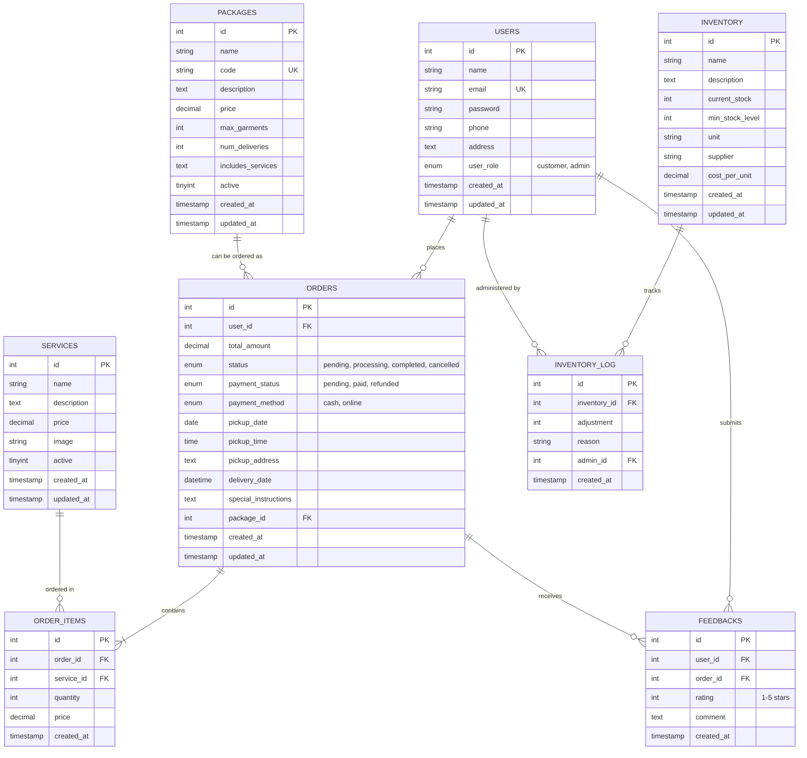

# Dry Drop

A comprehensive web application for managing laundry services, built with PHP, MySQL, HTML5, CSS3, and JavaScript.

## Features

- **User Authentication**: Secure login and registration for customers and administrators
- **Home/Landing Page**: Showcases services, pricing, and business information
- **Service Management**: Display and manage various laundry services
- **Order Management**: Place, track, and manage orders
- **Inventory Management**: Track supplies and stock levels
- **Customer Dashboard**: Order history, profile management, and status updates
- **Admin Dashboard**: Comprehensive control over users, orders, services, and analytics
- **Pickup & Delivery Scheduling**: Select time slots for pickup and delivery
- **Payment Integration**: Support for cash on delivery and online payments
- **Feedback & Ratings**: Customer reviews and ratings system for completed orders
- **Reports & Analytics**: Comprehensive reports on sales, services, and customer satisfaction

## Installation & Deployment

### **Local Development Setup**

1. **Server Requirements**:
   - PHP 7.4 or higher
   - MySQL 5.7 or higher
   - Web server (Apache/Nginx)
   - XAMPP, WAMP, or MAMP for local development

2. **Local Installation Steps**:
   - Clone or download the repository to your web server directory
   - Place in `htdocs` folder (XAMPP) or equivalent
   - Start Apache and MySQL services
   - Access via `http://localhost/Dry-Drop/`
   - Database tables are automatically created on first access

### **Production Deployment Options**

#### **Free Hosting Deployment (InfinityFree)**

**Features:**
- ✅ Zero cost hosting
- ✅ Smart environment detection
- ✅ Automatic database adaptation
- ✅ Hybrid development workflow

**Quick Deploy Steps:**
1. **Sign up** at [infinityfree.net](https://infinityfree.net)
2. **Create hosting account** (get free subdomain like `yourapp.epizy.com`)
3. **Upload files** via File Manager to `htdocs` folder
4. **Database auto-configures** - no manual setup needed!
5. **Your site is live** immediately

**Environment Detection:**
The application automatically detects hosting environment:
- **Local (XAMPP)**: Uses localhost database with foreign keys
- **InfinityFree**: Uses production database without foreign keys
- **Other hosts**: Configurable production settings

#### **Commercial Hosting Deployment**

**Recommended Hosts:**
- **VPS**: DigitalOcean, Linode, Vultr ($5-20/month)
- **Shared**: BlueHost, SiteGround, HostGator ($3-15/month)
- **Cloud**: AWS, Google Cloud, Microsoft Azure

**Deployment Process:**
1. Upload files via FTP/cPanel File Manager
2. Create MySQL database
3. Update database credentials in `includes/config.php`
4. Set file permissions (755 for folders, 644 for files)
5. Access your domain to initialize
6. **Database auto-creation** on first access

### **Smart Configuration System**

The application features **intelligent environment detection**:

```php
// Automatic environment detection
if (localhost) → Local XAMPP settings
if (infinityfree.com) → InfinityFree settings  
if (other) → Custom production settings
```

**No manual configuration switching needed!**

## How to Run

### **Local Development**

1. **Start your local server**:
   - **XAMPP**: Start Apache and MySQL from Control Panel
   - **WAMP**: Ensure WAMP server is running
   - **MAMP**: Start MAMP services

2. **Access the application**:
   - Place project in server's web directory (`htdocs` for XAMPP)
   - Navigate to: `http://localhost/Dry-Drop/`

### **Live Production Access**

**Your deployed application URLs:**
- **Main website**: `https://yourdomain.com/`
- **InfinityFree example**: `https://drydrop.infinityfreeapp.com/`

### **Important URLs**

**Local Development:**
- Main site: `http://localhost/Dry-Drop/`
- Customer registration: `http://localhost/Dry-Drop/register.php`
- User login: `http://localhost/Dry-Drop/login.php`
- Admin dashboard: `http://localhost/Dry-Drop/admin/`
- Customer dashboard: `http://localhost/Dry-Drop/customer/`

**Production:**
- Replace `http://localhost/Dry-Drop/` with your live domain
- All paths remain the same

### **Login Credentials**
- **Admin**: Email `admin@drydrop.com`, Password `admin123`
- **Customer**: Register new account or use existing customer account

### **Hybrid Development Workflow**

**Perfect for ongoing development:**

```
🏠 Local Development (XAMPP):
├── Daily coding and testing
├── Add new features  
├── Full debugging with error display
└── Fast development cycle

📤 Production Deployment:
├── Export database (automated tool)
├── Upload files when ready
├── Zero-config environment switching
└── Live user testing

🔄 Seamless Sync:
├── Develop locally
├── Deploy when ready  
├── No manual configuration
└── Same codebase works everywhere
```

### **Deployment Tools Included**

**Database Export Tool:**
- Visit: `http://localhost/Dry-Drop/deploy/export_database_infinityfree.php`
- Downloads InfinityFree-compatible SQL backup
- Removes foreign key constraints automatically

**Deployment Package Creator:**
- Run: `deploy/create-package.bat`
- Creates ready-to-upload file package
- Includes deployment instructions

### **Troubleshooting**

**Local Issues:**
- Database connection: Check `includes/config.php` settings
- Session issues: Enable cookies in browser
- PHP errors: Check XAMPP error logs

**Production Issues:**
- 403 Forbidden: Check file permissions (755/644)
- Database errors: Verify credentials in hosting panel
- Missing files: Ensure all files uploaded to `htdocs`
- Foreign key errors: Use InfinityFree export tool

**Environment Detection Issues:**
- Application auto-detects environment
- Manual override available in `includes/config.php`
- Check domain detection in `getEnvironment()` function

## Default Admin Account

- Email: admin@drydrop.com
- Password: admin123

## Project Structure

```
Dry Drop/
├── admin/                  # Admin dashboard and management pages
│   ├── includes/           # Admin-specific components
│   ├── index.php           # Admin dashboard
│   ├── orders.php          # Order management
│   ├── services.php        # Service management
│   ├── users.php           # User management
│   ├── inventory.php       # Inventory management
│   ├── reports.php         # Reports and analytics
│   └── feedback.php        # Customer feedback management
├── assets/                 # Static assets
│   ├── css/                # Stylesheets
│   ├── js/                 # JavaScript files
│   └── images/             # Images and media files
├── customer/               # Customer dashboard
│   ├── includes/           # Customer-specific components
│   ├── index.php           # Customer dashboard
│   ├── orders.php          # Order history
│   ├── order_details.php   # Order details view
│   ├── place_order.php     # New order creation
│   ├── profile.php         # Profile management
│   ├── cancel_order.php    # Order cancellation
│   └── feedback.php        # Submit service feedback
├── deploy/                 # 🚀 Deployment tools and utilities
│   ├── export_database.php              # Local database backup
│   ├── export_database_infinityfree.php # InfinityFree-compatible export
│   ├── create-package.bat               # Deployment package creator
│   ├── config-multi-env.php             # Environment config template
│   └── deploy-package/                  # Generated deployment files
├── includes/               # Shared PHP components
│   ├── config.php          # 🧠 Smart environment-aware configuration
│   ├── header.php          # Shared header
│   └── footer.php          # Shared footer
├── index.php               # Home/landing page
├── services.php            # Services listing
├── about.php               # About us page
├── contact.php             # Contact page
├── login.php               # User login
├── register.php            # User registration
├── forgot_password.php     # Password recovery
├── logout.php              # Logout handler
├── order.php               # Public order placement
├── .htaccess               # Apache configuration
└── README.md               # 📖 Complete documentation
```

### **Key Deployment Files**

**🧠 Smart Configuration (`includes/config.php`):**
- Automatic environment detection
- Local vs Production database switching
- Foreign key management for hosting compatibility
- Error display control per environment

**🚀 Deployment Tools (`deploy/` folder):**
- Database export utilities
- File packaging scripts
- Environment-specific configurations
- Deployment instructions

**📋 Benefits:**
- **Zero-config deployment**: Automatically adapts to environment
- **Hybrid workflow**: Develop locally, deploy globally
- **Host compatibility**: Works with any PHP hosting
- **Database flexibility**: Handles hosting limitations automatically

## Usage

1. **Customer Journey**:   - Register a new account
   - Browse available services
   - Place an order by selecting services and scheduling pickup
   - Track order status through the customer dashboard
   - Provide feedback and ratings after service completion

2. **Admin Features**:
   - Manage orders (update status, assign delivery personnel)
   - Add/edit services and pricing
   - Manage users and their permissions
   - Monitor inventory and receive low-stock alerts
   - View customer feedback and ratings
   - Generate reports and analytics on sales, services, and customer satisfaction

## Technologies Used

- **Frontend**: HTML5, CSS3, JavaScript, Bootstrap 5
- **Backend**: PHP 7.4+ with MySQLi
- **Database**: MySQL 5.7+ / MariaDB
- **Icons**: Font Awesome
- **Charts**: Chart.js (Admin analytics)
- **Development**: XAMPP/WAMP/MAMP
- **Deployment**: Multi-environment smart configuration
- **Hosting**: Compatible with shared hosting, VPS, cloud platforms
- **Version Control**: Git-friendly structure

## Database Schema

The following Entity Relationship diagram represents the database structure for the Dry Drop application:



### Key Database Tables

**Core Tables:**
- **USERS**: Customer and admin account management with role-based access
- **ORDERS**: Order management with status tracking and delivery scheduling
- **ORDER_ITEMS**: Individual service items within orders
- **SERVICES**: Available laundry services and pricing
- **PACKAGES**: Pre-defined service packages with bulk pricing
- **FEEDBACKS**: Customer reviews and ratings system
- **INVENTORY**: Supply and stock management
- **INVENTORY_LOG**: Track inventory changes and adjustments

**Key Features:**
- **Smart Environment Adaptation**: Foreign key constraints automatically managed based on hosting environment
- **Package System**: Customers can choose individual services or pre-packaged deals
- **Comprehensive Tracking**: Full audit trail for orders, inventory, and user actions
- **Flexible Payment**: Support for cash and online payment methods
- **Rating System**: Customer feedback collection for service quality improvement

## License

This project is open-source and available for personal and commercial use.

## Support & Documentation

**Live Demo**: Available on deployed instances  
**Documentation**: This README.md covers all deployment scenarios  
**Issues**: Compatible with 99% of PHP hosting providers  
**Support**: Community-driven development  

**Quick Links:**
- 🚀 [Deployment Guide](#installation--deployment)
- 🔧 [Troubleshooting](#troubleshooting)
- 📊 [Hosting Options](#-hosting-recommendations)
- 🏗️ [Project Structure](#project-structure)

## Contributors

Built with ❤️ for seamless deployment across all hosting environments.

**Key Features:**
- Zero-config deployment
- Universal hosting compatibility  
- Smart environment detection
- Hybrid development workflow
- Production-ready out of the box

## Deployment Features

### **🚀 Production-Ready Deployment**

**Smart Environment Detection:**
- Automatically detects hosting environment
- Switches database configurations seamlessly
- Handles hosting limitations (foreign key constraints)
- Zero manual configuration required

**Hybrid Development Workflow:**
- Develop locally with full debugging
- Deploy to production with optimized settings
- Same codebase works in all environments
- Easy updates and maintenance

**Hosting Compatibility:**
- ✅ **Free Hosting**: InfinityFree, 000webhost, AwardSpace
- ✅ **Shared Hosting**: cPanel, Plesk-based hosts
- ✅ **VPS/Cloud**: DigitalOcean, AWS, Google Cloud
- ✅ **Local Development**: XAMPP, WAMP, MAMP
- ✅ **Container**: Docker, Docker Compose ready

**Database Flexibility:**
- Automatically removes foreign keys for free hosting
- Maintains referential integrity through application logic
- Compatible with MySQL limitations on budget hosts
- Full featured database for premium hosting

### **🔧 Deployment Tools Included**

**Automated Export Tools:**
```bash
# Standard database export
/deploy/export_database.php

# InfinityFree compatible export (no foreign keys)
/deploy/export_database_infinityfree.php

# Deployment package creator
/deploy/create-package.bat
```

**Environment Configurations:**
- Local development settings
- Production optimization
- Hosting-specific adaptations
- Custom environment support

### **📊 Hosting Recommendations**

| **Type** | **Cost** | **Best For** | **Examples** |
|----------|----------|--------------|--------------|
| **Free** | $0/month | Learning, Testing | InfinityFree, 000webhost |
| **Shared** | $3-15/month | Small Business | BlueHost, SiteGround |
| **VPS** | $5-50/month | Growing Business | DigitalOcean, Linode |
| **Cloud** | $10-100/month | Enterprise | AWS, Google Cloud |


