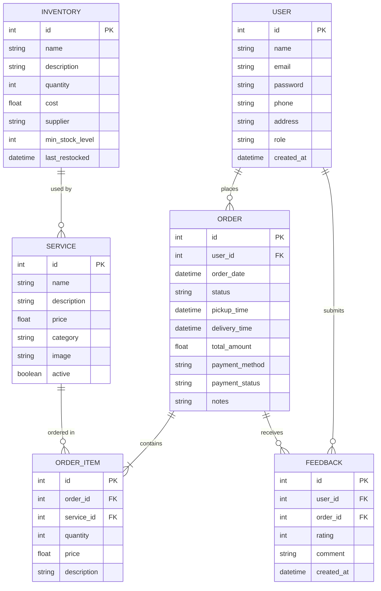

# Dry Drop

A comprehensive web application for managing laundry services, built with PHP, MySQL, HTML5, CSS3, and JavaScript.

## Features

- **User Authentication**: Secure login and registration for customers and administrators
- **Home/Landing Page**: Showcases services, pricing, and business information
- **Service Management**: Display and manage various laundry services
- **Order Management**: Place, track, and manage orders
- **Inventory Management**: Track supplies and stock levels
- **Customer Dashboard**: Order history, profile management, and status updates
- **Admin Dashboard**: Comprehensive control over users, orders, services, and analytics
- **Pickup & Delivery Scheduling**: Select time slots for pickup and delivery
- **Payment Integration**: Support for cash on delivery and online payments
- **Feedback & Ratings**: Customer reviews and ratings system for completed orders
- **Reports & Analytics**: Comprehensive reports on sales, services, and customer satisfaction

## Installation

1. **Database Setup**:
   - Create a MySQL database named 'drydrop'
   - The database tables will be automatically created when you first access the application

2. **Server Requirements**:
   - PHP 7.4 or higher
   - MySQL 5.7 or higher
   - Web server (Apache/Nginx)

3. **Installation Steps**:
   - Clone or download the repository to your web server directory
   - Configure your database connection in `includes/config.php` if needed (default uses localhost, root, no password)
   - Access the application through your web browser

## How to Run

1. **Start your local server**:
   - If using XAMPP: Start Apache and MySQL services from the XAMPP Control Panel
   - If using WAMP: Ensure the WAMP server is running
   - If using MAMP: Start the MAMP services

2. **Access the application**:
   - Place the project in your server's web directory (e.g., `htdocs` for XAMPP, `www` for WAMP)
   - Open your browser and navigate to one of these URLs:

3. **Important URLs**:
   - Main website: `http://localhost/Dry-Drop/`
   - Customer registration: `http://localhost/Dry-Drop/register.php`
   - User login: `http://localhost/Dry-Drop/login.php`
   - Admin dashboard (after login): `http://localhost/Dry-Drop/admin/index.php`
   - Customer dashboard (after login): `http://localhost/Dry-Drop/customer/index.php`

4. **Login credentials**:
   - Admin: Email `admin@drydrop.com`, Password `admin123`
   - Customer: Register a new account or use an existing customer account

5. **Troubleshooting**:
   - If you encounter database connection issues, verify your database settings in `includes/config.php`
   - Ensure your web server has PHP write permissions to create/update the database
   - For session-related issues, check that cookies are enabled in your browser

## Default Admin Account

- Email: admin@drydrop.com
- Password: admin123

## Project Structure

```
Dry Drop/
├── admin/                  # Admin dashboard and management pages
│   ├── includes/           # Admin-specific components
│   ├── index.php           # Admin dashboard
│   ├── orders.php          # Order management
│   ├── services.php        # Service management
│   ├── users.php           # User management
│   ├── inventory.php       # Inventory management
│   ├── reports.php         # Reports and analytics
│   └── feedback.php        # Customer feedback management
├── assets/                 # Static assets
│   ├── css/                # Stylesheets
│   ├── js/                 # JavaScript files
│   └── images/             # Images
├── customer/               # Customer dashboard
│   ├── includes/           # Customer-specific components
│   ├── index.php           # Customer dashboard
│   ├── orders.php          # Order history
│   ├── order_details.php   # Order details view
│   ├── place_order.php     # New order creation
│   ├── profile.php         # Profile management
│   ├── cancel_order.php    # Order cancellation
│   └── feedback.php        # Submit service feedback
├── includes/               # Shared PHP components
│   ├── config.php          # Database and app configuration
│   ├── header.php          # Shared header
│   └── footer.php          # Shared footer
├── index.php               # Home/landing page
├── services.php            # Services listing
├── about.php               # About us page
├── contact.php             # Contact page
├── login.php               # User login
├── register.php            # User registration
├── forgot_password.php     # Password recovery
├── logout.php              # Logout handler
├── order.php               # Public order placement
└── .htaccess               # Apache configuration
```

## Usage

1. **Customer Journey**:   - Register a new account
   - Browse available services
   - Place an order by selecting services and scheduling pickup
   - Track order status through the customer dashboard
   - Provide feedback and ratings after service completion

2. **Admin Features**:
   - Manage orders (update status, assign delivery personnel)
   - Add/edit services and pricing
   - Manage users and their permissions
   - Monitor inventory and receive low-stock alerts
   - View customer feedback and ratings
   - Generate reports and analytics on sales, services, and customer satisfaction

## Technologies Used

- **Frontend**: HTML5, CSS3, JavaScript, Bootstrap 5
- **Backend**: PHP
- **Database**: MySQL
- **Icons**: Font Awesome
- **Charts**: Chart.js

## Database Schema

The following Entity Relationship diagram represents the database structure for the Dry Drop application:



## License

This project is open-source and available for personal and commercial use.

## Support

For any questions or issues, please contact support@drydrop.com
